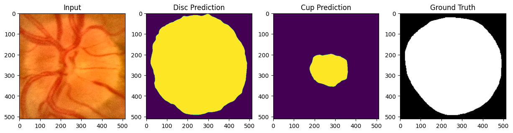

# Automated Gluacoma Detection

## Setup

This project requires certain dependencies to run. These dependencies are listed in the `requirements.txt` file.

To set up the project:

1. Clone the repository to your local machine.
2. Navigate to the project root directory in your terminal.

If you are on a Windows machine, run the following command:

```cmd
setup.bat
```
If you are not on a Windows machine (like Linux or MacOS), run the following command:

```cmd
sh setup.sh
```

# Setting up the environment

## Image Processing

The `image_processing.py` script performs several tasks:

1. **Load Images and Annotations:** The script loads images and their corresponding annotations from the "ORIGA 200 Images" directory. The images are loaded in RGB format using OpenCV, and the annotations are loaded as binary masks using PIL.

2. **Crop Images:** The script crops each image to the bounding box of the non-zero area in its corresponding annotation. This is done to focus on the area of interest in each image.

3. **Save Processed Images:** The cropped images are saved in the "ProcessedImages" directory. The images are saved as .png files and the annotations are saved as .tif files. The filenames are numbered starting from 1. The unlabeled images (original images) are at even indices and the labeled images (annotations) are at odd indices.

To run the script, navigate to the project root directory in your terminal and run the following command:

```cmd
python src/image_processing.py
```
4. **Run the Models:** Run the evaluation.py it will train the model and save the model in the models directory.

```cmd
python src/evaluation.py
```
## After you have run the evaluation.py you would have made the models and then you can run the stream lit app to see the results.

```cmd
streamlit run app.py
```

## Model Training and Evaluation
The models are trained using the Adam optimizer with a learning rate scheduler. The loss function is Dice Loss for binary segmentation. The models are evaluated using precision, F1 score, and IoU score.

## Here are the accuracy metrics for the trained models:

### Disc Model Metrics:

######  Precision: 0.9654836663623448
###### F1 Score: 0.9666221319693521
###### IoU Score: 0.9354004588964974
###### Cup Model Metrics:

### Cup Model Metrics:

###### Precision: 0.9052005632416757
###### F1 Score: 0.8982977065530765
###### IoU Score: 0.8153724576015451
###### The training loss curves for the models can be seen in the image below:


Sample outputs of the model on training data can be seen in the images below:


Sample outputs of the model on training data can be seen in the images below:




